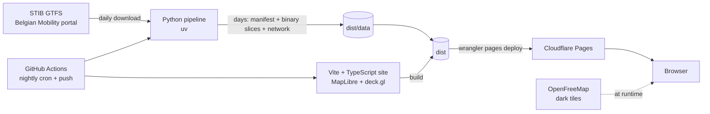

# stib-viz: version 1 architecture

Status: frozen on 5 September 2026, revised the same day after an architecture review
(ten findings folded in, see section 11). Scope in [SCOPE.md](SCOPE.md), background in
[docs/01-exploration.md](docs/01-exploration.md). Library versions are chosen at implementation
time, against the official documentation.

## 1. Principles

1. **Static first.** All heavy work happens in the pipeline. The browser downloads binary arrays
   and draws them; it computes neither timetables nor geometry.
2. **A data contract independent of its source.** The site consumes a "day" described by a
   manifest and binary slices. The scheduled timetable fills that contract today; a real-time
   recorder will fill it tomorrow without touching the site. The contract is tested from both
   sides: the pipeline writes it, the site decodes it, from the same versioned extract.
3. **Reproducible and verified.** The pipeline is a pure function of the GTFS feed and a date.
   Every run passes numeric checks before publication.
4. **Tests first.** Every module starts from a failing test. Logic is kept apart from rendering so
   it stays testable without a browser.
5. **Small and readable.** No UI framework, no server, no database.

## 2. Overview



Two executables, one contract between them:

- `pipeline/` produces `dist/data/`: an index of days, then per day a manifest, binary slices by
  hour and mode, per-hour stop files, and per feed version a network layer and a lookup table
  for v2.
- `web/` is a static site that reads `dist/data/` and animates it.

## 3. Repository layout

```
stib-viz/
├── SCOPE.md  ARCHITECTURE.md  README.md  SECURITY.md  LICENSE
├── docs/                         exploration, decisions, screenshots
├── pipeline/                     Python 3.12, uv, ruff, pytest
│   ├── pyproject.toml
│   ├── src/stibviz/
│   │   ├── cli.py                stibviz fetch | build | check | index
│   │   ├── fetch.py              GTFS download with ETag and digest
│   │   ├── gtfs.py               table reading and validation
│   │   ├── service_day.py        date → active services → trips of the 04:00-04:00 day
│   │   ├── geometry.py           local projection in metres, distances, Douglas-Peucker
│   │   ├── shapes.py             shapes: cumulative distance, stop projection, simplification
│   │   ├── vehicles.py           trip chaining by block_id, layovers, deadhead cuts
│   │   ├── trajectories.py       (lon, lat, t) sampling along shapes
│   │   ├── slicing.py            hour slicing with asymmetric overlap
│   │   ├── network.py            network layer, stop dictionary, v2 lookup table
│   │   ├── stats.py              per-minute series, kilometres, routes
│   │   ├── encode.py             binary slices, stop files, vehicles and manifest writing
│   │   ├── checks.py             quality checks, thresholds, per-object anomalies
│   │   └── build.py              one day from feed to checked bundle, steps 3 to 13 in order
│   ├── tools/make_extract.py     cuts the test extract out of the full feed
│   └── tests/
│       ├── fixtures/gtfs-extract/   real three-route extract (metro 1, tram 7, Noctis N06 on
│       │                            Friday 11 September 2026), under 500 KB, with its expected
│       │                            values in expected.json
│       └── …                        minimal synthetic fixtures and unit tests
├── web/                          Vite, strict TypeScript, pnpm
│   ├── index.html
│   ├── src/
│   │   ├── main.ts               entry point: starts the app, shows a fatal error
│   │   ├── app.ts                wiring: loading, mounting, animation loop, stibviz debug API
│   │   ├── data/                 contract types and parsers, loader, STV1 decoding, slice store,
│   │   │                         stops of the hour on demand
│   │   ├── time/                 service-day clock, player (speed, pause, waiting)
│   │   ├── render/               MapLibre map, deck.gl layers, current positions, selection
│   │   ├── ui/                   clock, day selector, counters, activity curve and scrubber,
│   │   │                         filters, vehicle panel, about
│   │   ├── state/                single state object and URL synchronisation
│   │   ├── theme/                night basemap style, mode colours
│   │   └── i18n/                 fr.ts, centralised UI copy
│   ├── tests/                    vitest (jsdom for the UI), including the contract test
│   └── e2e/                      Playwright smoke tests on the fixture day, tiles blocked
├── .github/
│   ├── dependabot.yml            monthly updates: actions, npm, uv
│   └── workflows/
│       ├── ci.yml                lint, types, unit tests, contract, smoke, on push and PR
│       └── nightly.yml           seven-day pipeline + build + Cloudflare Pages deployment
└── dist/                         generated, git-ignored
```

The site's fixture day is not a versioned file: CI produces it on every run with `stibviz build`
against the `pipeline/tests/fixtures/gtfs-extract/` extract. It therefore cannot drift from the
pipeline code.

## 4. The pipeline

### 4.1 Inputs

- URL of the static STIB GTFS feed on the Belgian Mobility portal (downloadable without a key,
  around 14.5 MB, refreshed every morning). A local file can replace it for tests and offline work.
- Parameters, each with a versioned default: simplification tolerance (2 m), service-day start
  (04:00), slice overlap (300 s before the lower bound, 120 s after the upper bound), deadhead cut
  threshold (100 m), per-object anomaly tolerance (0.1% of trips), day window (yesterday, today,
  plus five).

### 4.2 Steps

| Step | Module | Input → output | Points of attention |
|---|---|---|---|
| 1. Download | `fetch` | URL → `gtfs.zip`, ETag, SHA-256 | Conditional `If-None-Match` request; the archive is validated (size, expected entries, no path escaping the destination directory) |
| 2. Read and validate | `gtfs` | archive → typed tables | Required files and columns, validity range covering the requested dates, `HH:MM:SS` times where `HH` may exceed 24 |
| 3. Service day | `service_day` | date → service ids → trips | `calendar` plus `calendar_dates` exceptions. Rule: a trip belongs to the day when its first departure falls in `[04:00, 28:00)` in GTFS time of that date. Its trajectory is written through to arrival; any part beyond 28:00 is truncated by interpolation and counted as an anomaly. A trip departing before 04:00 is dropped and counted. The previous day is never loaded: by this rule, Friday's Noctis trips belong to Friday's span |
| 4. Shapes | `shapes` | `shapes.txt` → polylines in metres, cumulative distance | Local equirectangular projection in metres centred on the feed (`geometry`), exact to the centimetre at Brussels scale; no shapely or pyproj. Cumulative distance is computed on the original geometry and checked against `shape_dist_traveled` from `shapes.txt` |
| 5. Stop projection | `shapes` | (original shape, stop sequence) → distance along the shape for each stop | The STIB feed has no `shape_dist_traveled` in `stop_times`. Projection onto the **original** shape, constrained to increase along it; stop-to-shape offset measured and checked |
| 6. Simplification | `shapes` | original shape → subset of vertices | Douglas-Peucker keeps only original vertices, which retain their original distances. Between two kept vertices, position interpolates along the chord in proportion to the original distances. Kilometres and times are always computed from the original distances, never from chord lengths |
| 7. Vehicles | `vehicles` | trips → trip sequences per `block_id` | The terminus layover is not emitted as a segment: the path stops at arrival and the next one starts at departure; the idle head is drawn by the point layer (section 6.3). If the next trip starts more than 100 m from the arrival point it is a deadhead move: nothing is drawn between the two. A trip without a `block_id` forms a vehicle of its own; a `block_id` whose trips overlap in time is split into two vehicles and counted as an anomaly |
| 8. Trajectories | `trajectories` | trip → list of `(lon, lat, t)` | Constant speed between two consecutive stops; vertices sampled at the kept shape vertices plus the stops; time in seconds since 04:00 |
| 9. Slices | `slicing` | trajectories → at most 24 slices per mode | Slice `h` holds the portions active in `[h − 300 s, h + 1 h + 120 s)`, cut by interpolation at the bounds. Upstream overlap is sized by trail length, downstream overlap by switching latency. Only non-empty slices are written; the manifest list is authoritative |
| 10. Network and v2 table | `network` | simplified original shapes + trips → stop-to-stop segments with run counts; stop dictionary; lookup table | Five intensity classes; metro carries an "underground" flag. The lookup table (section 5.7) is not read by the v1 site |
| 11. Statistics | `stats` | trips, vehicles → counters | Per mode and per minute (1,440 values): active vehicles, trips departed since 04:00 cumulatively, kilometres covered since 04:00 cumulatively; route list with colours |
| 12. Encoding | `encode` | everything → files under `dist/data/<date>/` | See section 5 |
| 13. Checks | `checks` | produced files → report | See section 4.3 |

### 4.3 Quality checks

Two levels, with versioned thresholds:

- **Global anomalies, blocking**: the day is not published.
- **Per-object anomalies, tolerated** under 0.1% of the day's trips: the object is dropped or
  corrected, the anomaly is logged and summarised in the manifest (`anomalies`). Above the
  threshold the day is blocked.

Blocking checks:

1. Required files and columns present; the validity range covers the date.
2. Every trip of the day has a shape present in `shapes.txt`.
3. Trip and vehicle counts equal a direct count of the trips whose departure falls in the span.
4. Peak simultaneous vehicles equals a direct per-minute count.
5. Size: at most 2.5 MB per slice, 35 MB per day including overlap; daily vertex count bounded.
6. Every route has a colour and a label.
7. The manifest validates against its JSON schema; every listed slice exists and no unlisted slice
   exists.
8. Read-back of the written binaries: decoding and verification of a sample of trajectories.
9. Recomputed cumulative distance consistent with `shape_dist_traveled` from `shapes.txt`
   (relative error under 1% per shape).

Per-object anomalies:

1. Stop-to-shape offset above 80 m (the global median must stay under 15 m).
2. Stop distances not increasing along the shape.
3. Times not increasing along a trajectory.
4. Trip departing before 04:00, or arriving after 28:00 (truncated).
5. Time overlap inside a `block_id`.
6. Deadhead move detected (informational only, never counted as an anomaly).

The values measured for Wednesday 9 September 2026 (18,784 trips, 1,299 vehicles, peak of 752
vehicles at 17:03 counted at the top of the minute, see SCOPE.md section 3) are a **manual
acceptance criterion for milestone M1**, not a CI test: they expire with the feed on
27 September 2026. They were reproduced on 5 September 2026: 66 slices, 30.5 MB, largest slice
1.29 MB, manifest 103 KB, median stop offset 1.07 m, no anomaly. CI relies on the versioned
extract and its own expected values.

### 4.4 Command line interface

```
stibviz fetch  --url <URL> --out cache/          download when the feed has changed
stibviz build  --gtfs cache/gtfs.zip --date 2026-09-09 --out dist/data/
stibviz check  --day dist/data/2026-09-09/
stibviz index  --data dist/data/                 writes dist/data/index.json
```

Every command returns a non-zero exit code on failure and writes a readable log.

### 4.5 Target performance

Under 60 s per day, under 8 minutes for the seven days on a standard GitHub runner. The
feasibility analysis read and aggregated the complete feed in about thirty seconds with pandas;
trajectory generation is vectorised with numpy.

## 5. Data contract

Everything the site knows about the data passes through these files. The pipeline is their only
writer; a real-time recorder will write the same format in v2.

### 5.1 Layout

```
dist/data/
├── index.json                       available days, feed version, generation date
├── network/<feed-version>.json      network layer and stop dictionary, shared
├── lookup/<feed-version>.json       v2 lookup table, not read by the v1 site
└── 2026-09-09/
    ├── manifest.json                statistics, routes, slice index
    ├── vehicles.json                vehicles and their trips, read when the panel opens
    ├── slices/
    │   ├── 04-metro.bin  04-tram.bin  04-bus.bin
    │   ├── 05-metro.bin  ...
    │   └── 27-bus.bin               hour 27 is 03:00 the next morning
    └── stops/
        ├── 04.json  05.json  ...    stops of the trips active in that hour, loaded on click
```

Only non-empty slices exist: a Wednesday has no Noctis file at all, a Saturday has them for hours
00 to 03 of the next morning. The site requests only what the manifest lists.

### 5.2 `index.json`

```json
{
  "generated_at": "2026-09-09T06:40:12Z",
  "feed_version": "2_20_20260831_010702",
  "feed_valid_from": "2026-08-31",
  "feed_valid_to": "2026-09-27",
  "service_day_start": "04:00",
  "days": [
    { "date": "2026-09-08", "kind": "weekday", "source": "schedule", "manifest": "2026-09-08/manifest.json" },
    { "date": "2026-09-09", "kind": "weekday", "source": "schedule", "manifest": "2026-09-09/manifest.json" }
  ]
}
```

`source` is `schedule` in v1; a day recorded in v2 will be `recorded`, which lets the site offer
the choice without opening every manifest.

### 5.3 `manifest.json`

Budget: 300 KB at most. It carries neither geometry nor stops.

```json
{
  "date": "2026-09-09",
  "source": "schedule",
  "feed_version": "2_20_20260831_010702",
  "attribution": "Source: STIB-MIVB – Open Data – 2026-09-05",
  "network": "network/2_20_20260831_010702.json",
  "totals": { "trips": 18784, "vehicles": 1299, "km": 164365 },
  "per_minute": {
    "vehicles":   { "metro": [0, 0, "…"], "tram": ["…"], "bus": ["…"], "noctis": ["…"] },
    "departures": { "metro": [0, 0, "…"], "tram": ["…"], "bus": ["…"], "noctis": ["…"] },
    "km":         { "metro": [0, 0, "…"], "tram": ["…"], "bus": ["…"], "noctis": ["…"] }
  },
  "routes": [
    { "id": "1", "name": "1", "mode": "metro", "color": "B5378C", "text_color": "FFFFFF",
      "long_name": "GARE DE L'OUEST - STOCKEL" }
  ],
  "vehicles_file": "vehicles.json",
  "vehicle_count": 1299,
  "slices": [
    { "hour": 4, "mode": "metro", "path": "slices/04-metro.bin", "bytes": 81240, "vertices": 6770, "paths": 41 }
  ],
  "stops_files": [ { "hour": 4, "path": "stops/04.json", "bytes": 210400 } ],
  "anomalies": { "stop_offset": 3, "truncated_after_28h": 0, "block_overlap": 0 }
}
```

Each `per_minute` series holds 1,440 values, from 04:00 to 03:59 the next morning; `vehicles` is
an instantaneous count, `departures` and `km` are cumulative since 04:00. The interface counters
and the activity curve read straight from these series. The Wednesday manifest measures 103 KB.

`vehicles.json` lists the vehicles in the order of their index in the slices, each with its
`block` and its `trips` (`route_idx`, `headsign`, `start`, `end` in seconds since 04:00,
`from_layover`). About 1.7 MB for a Wednesday; the site reads it the first time a vehicle panel
opens, not for the first frame. Trip times are enough to place the head of a vehicle during its
layover.

### 5.4 Binary slice `HH-mode.bin`

Little-endian, one file per hour and mode, written only when it holds at least one path:

| Field | Type | Content |
|---|---|---|
| header | 6 × Uint32 | magic `0x53545631` ("STV1"), version, vertex count `V`, path count `P`, slice hour, reserved |
| positions | Float32 × 2V | longitude, latitude interleaved |
| times | Float32 × V | seconds since 04:00 of the service day |
| index | Uint32 × (P + 1) | start offset of each path in the arrays, last element equal to `V` |
| vehicle | Uint32 × P | index into `manifest.vehicles` |
| trip | Uint16 × P | index of the trip within the vehicle |
| route | Uint16 × P | index into `manifest.routes`, the source of the colour |

A path is a continuous portion of one vehicle's trajectory within the slice; it never holds two
identical consecutive vertices. A vehicle may yield several paths (terminus cut, deadhead move,
slice bounds). Positions, times and index are passed to deck.gl as they are; the per-vertex colour
is unfolded once at load time from `route`.

Precision: in Float32, longitude quantises to 3 cm and latitude to 40 cm at Brussels, invisible at
city scale. Seconds since 04:00 stay exact integers. Should size become a problem, v2 quantises
positions to 16 bits relative to the bounding box (see SCOPE.md section 6).

### 5.5 Network layer `network/<version>.json`

GeoJSON of simplified stop-to-stop segments, with `mode`, `runs` (runs on a typical weekday),
`class` (1 to 5) and `underground` (true for metro), plus a `stops` dictionary giving each
`stop_id` its position and French name. One file per feed version, around 1 MB, long cache.

### 5.6 Stops of one hour `stops/HH.json`

For each trip active in the hour, the list of its stops with their scheduled time, keyed by
`"<vehicle index>:<trip index>"`:

```json
{ "412:3": [[46800, "1781"], [46920, "4351"], [47040, "4359"]] }
```

Loaded on the first click within that hour, never earlier. Names come from the `stops` dictionary
of the network layer.

### 5.7 Lookup table `lookup/<version>.json`

Written by v1, read only by the v2 real-time converter: for each shape, the ordered list of its
stops with their distance along the shape; for each route and direction, the candidate shapes.
It is the only artefact the recorder will need beyond the pipeline modules.

## 6. The site

### 6.1 Loading flow

1. Read `index.json`; choose the day (URL, else today, else the nearest one).
2. Read the manifest and the network layer; build the activity curve and the counters.
3. Load the current hour's slices for the visible modes, among those the manifest lists; start
   playback.
4. While playing, prefetch the next hour; keep three hours in memory cache.
5. **Exactly one slice per mode is mounted at any instant.** Overlap serves prefetching and
   switching, never a double display. If the next slice is not ready when the switch is due,
   playback waits visibly rather than showing an incomplete hour.
6. On a day change, restart from step 2.

First-frame budget: manifest at most 300 KB, network layer at most 1 MB (long cache), one hour of
slices at most 2.5 MB; at most 4 MB in total, excluding basemap tiles.

### 6.2 Modules and responsibilities

| Module | Role | Tested by |
|---|---|---|
| `data/` | Loading and decoding the contract files, cache and prefetch, stops on demand | vitest: decoding the fixture day produced by the pipeline (contract test), cache, prefetch order, absent slices never requested |
| `time/` | Service-day clock (seconds since 04:00), variable-speed player driven by `requestAnimationFrame`, civil-time conversion, slice waiting | vitest: 90,000 s renders as 05:00 next day, speeds, pause, bounds, waiting |
| `render/` | MapLibre map, night style, network layer, deck.gl layers, current vehicle positions, click selection | vitest for position computation, layover and single-mount uniqueness; Playwright smoke test for rendering |
| `state/` | Single state object, subscriptions, URL read and write | vitest: URL round trip, invalid values ignored |
| `ui/` | Framework-free DOM components: clock, selector, counters, activity curve and scrubber, filters, vehicle panel, about | vitest with a simulated DOM for the logic; smoke test for the assembly |
| `theme/` | Mode colours, basemap style, visual constants | visual review |
| `i18n/` | French UI copy | a test that checks for missing keys |

### 6.3 Rendering

- Four deck.gl `TripsLayer`, one per mode, fed with binary attributes: positions, times and start
  indices passed as they are; the per-vertex colour is unfolded once when the slice loads, from
  the `route` field. Fixed at milestone M2 against deck.gl 9.3: `data` is
  `{ length: P, startIndices: index, attributes: { getPath: { value: positions, size: 2 },
  getTimestamps: { value: times, size: 1 }, getColor: { value: colours, size: 4, normalized: true } } }`
  with `_pathType: "open"` and `positionFormat: "XY"`. `PathLayer` sets
  `normalize: !props._pathType`, so the arrays are used as they are; a vitest asserts that the
  descriptor hands over the very typed arrays of the decoded slice, and that the same `data` object
  is reused from one frame to the next, because deck.gl compares it by reference and a new object
  would re-upload the whole hour on every frame. Only `currentTime` changes per frame. Trail length
  is a constant in service-day seconds (105 s, always below the 300 s upstream overlap), fading
  enabled: the visible length encodes speed. Joints and caps are square: invisible at two pixels,
  and the difference between 55 and 60 frames per second at the peak on an integrated GPU.
- One `ScatterplotLayer` for vehicle heads: each frame, the current position of every active path
  comes from a binary search in its time array followed by interpolation. A vehicle in layover
  between two trips (`end` of one, `start` of the next in the manifest, same terminus) keeps the
  end position of its last trip: the dot stays, the trail fades. Fewer than 800 points at peak,
  negligible cost. This layer carries click selection; the panel then loads `stops/HH.json` if
  needed.
- A vehicle is never drawn twice: exactly one slice mounted per mode (section 6.1); a vitest check
  verifies this on the fixture day.
- The network layer is a dark `GeoJsonLayer` beneath the vehicles; metro is dimmer still.
- Follow mode: while it is on and the selected vehicle has a head, every frame recentres the map
  on it with `jumpTo`; at ×300 the vehicle moves under a pixel per frame at zoom 14, so the camera
  glides. A `dragstart` from the person turns it off; stepping to a vehicle turns it on and eases
  the camera to zoom 13.5 at least.
- Layovers, in practice: between two paths of the same vehicle within the mounted slice, the head
  is held at the end of the first when both ends lie within 100 m of each other (the deadhead
  threshold of the pipeline); a wider gap is a deadhead move and draws nothing. Before the first
  path or after the last one, `vehicles.json` decides: the head is held when the adjacent trip is
  marked `from_layover` and the instant falls between the two trips. The list is fetched after the
  first frame; until then only the in-slice rule applies.
- Filtering a mode hides its layer and drops its slices from the prefetch queue.
- Selecting a line does not change what is mounted: every path of its mode stays loaded. Instead
  the colour buffer of the mounted slices is rebuilt — full opacity for the selected route index,
  a low fixed opacity for every other one — and restored on deselection. The rebuild touches only
  the colour arrays, not positions or times, and runs once per selection change, not per frame.
- Colour toggle: `theme/colors.ts` reads the route's own `color` field for every mode when the
  toggle is on, the mode palette when it is off; trams already read their own colour either way.
  Flipping the toggle rebuilds the colour buffers of the mounted slices the same way a line
  selection does. Colours come from the feed, not invented: STIB reuses roughly a dozen colours
  across its routes, so the toggle can still show two unrelated lines in the same colour — noted
  in the about panel.
- Performance: deck.gl renders at the screen ratio capped to 1.5 (`render/quality.ts`), so a
  phone at ratio 2 fills 44% fewer fragments for a picture whose trails are two pixels wide; the
  basemap keeps the full ratio, being cheap. Layers are created once; no allocation per frame
  outside slice switching. Measured on an integrated Intel GPU at the 17:03 peak with about 930
  vehicles: 55 to 60 frames per second in a 1600 by 1000 window, around 34 on a 390 by 844 phone
  viewport at ratio 2, which meets the "loads, reads and plays" promise SCOPE.md makes for mobile.

### 6.4 State and URL

A single state object (day, instant, speed, playing, filters, selected line, colour mode, camera
view, selected vehicle). Every change notifies the components. The URL updates on a short
debounce:

```
/?d=2026-09-09&t=17:03&s=300&m=metro,tram,noctis&l=7&colours=official&c=50.846,4.352,12.4&p=1
```

The link recreates the scene exactly. Invalid values are ignored one by one. Defaults are left
out: `m` only when a mode is hidden, `l` only with a selected line, `colours` only when official,
`c` (latitude, longitude, zoom; bearing and pitch are accepted and ignored) once the map has moved.
The URL is rewritten on a 300 ms debounce and only when the query changed, so playback at ×600
rewrites it a few times a second at most, well under the browser throttling of `replaceState`.

### 6.5 Night-time style

- Basemap: our own MapLibre style (`theme/basemap.ts`) over OpenFreeMap vector tiles, reduced to
  water, parks, three road classes and city, town and suburb names, all very dark; no point of
  interest. The basemap must never compete with the vehicles, and the page works without it.
- Modes: warm white for metro, official colour for trams, a single cool blue for buses, violet for
  Noctis by default; a colour toggle (section 6.3) switches every mode to its own route's official
  colour instead. Exact default values live in `theme/` and were tuned at milestone M2 against the
  real render.
- Network: five levels of one blue-grey, from nearly invisible to discreet.
- Interface: dark translucent panels, sober typography, tabular figures.

### 6.6 Accessibility and keyboard

Space: play and pause. Arrow keys: one minute; with Shift: ten minutes. One digit per speed, 1 to
5: ×60, ×120, ×300, ×600, ×1200. Every button has a label and a visible focus state. When the
visitor prefers reduced motion the page starts paused and the camera jumps instead of gliding.

The palette is held to WCAG 2.2 AA by a unit test that reads the tokens out of `style.css` and
measures each against the panel background; the smoke suite runs an axe audit of the page, of the
vehicle panel and of the about dialog, and walks every control to check it takes focus with a
visible ring. Mode filters are pills rather than bare checkboxes so their pointer targets keep the
24 pixels of clearance success criterion 2.5.8 asks for.

## 7. Integration and deployment

### 7.1 `ci.yml` (every push and pull request)

1. Pipeline: `uv sync`, `ruff check`, `ruff format --check`, `pytest --cov` with an 80% threshold,
   including the tests against the `gtfs-extract/` extract and its expected values.
2. Fixture day: `stibviz build` then `stibviz check` against the extract, uploaded as a one-day
   artifact that the web job downloads into `web/public/data`.
3. Site: `pnpm install`, `tsc --noEmit`, `eslint`, `prettier --check`, `vitest --coverage` with an
   80% threshold, including the contract test that decodes the fixture day.
4. Smoke: `pnpm build` with the fixture day, then Playwright: the page loads, the canvas exists,
   the clock advances during playback, the URL updates, the vehicle panel opens from an injected
   state.

The workflow declares `permissions: contents: read` and checks out without persisting credentials:
least privilege, so a compromised dependency cannot write to the repository. Every action is
pinned to a commit SHA rather than a tag, so a moved or compromised tag cannot change what
runs; Dependabot keeps those pins current.

### 7.2 `nightly.yml` (cron after the GTFS feed is published, plus manual dispatch)

Two runs a day, 04:45 and 10:45 UTC, plus manual dispatch; the first adds the new day of the
window, the second catches a feed published late. A run that has nothing to do stops in a minute.

1. `stibviz fetch` with the ETag cache kept between runs by `actions/cache`; then the published
   `index.json` is read from the live site.
2. `stibviz week` plans the window (yesterday to five days ahead, within the feed validity):
   nothing when the site already publishes every covered day for this feed version, the whole
   window otherwise, because a deployment replaces the site and a partial build would lose the
   other days.
3. The same command then builds each day independently, checking what it wrote: a failing day is
   set aside and reported, the others are still written; stale days outside the window are
   removed and `index.json` lists the valid days only. Its exit code says whether a day failed.
   `stibviz plan` still exists to see the window without building it.
4. `pnpm build` with the data in `web/public/data`, so `dist/` holds the site and its data.
5. `wrangler pages deploy` to the Cloudflare Pages project, production branch `main`, only when
   the Cloudflare secrets exist and at least one day was built: a fork builds without deploying,
   and a night where every day fails never replaces the live site with an empty one.
6. Only then, a non-zero exit code if at least one day failed, so failures are visible without
   depriving the site of the valid days. The per-day report is kept fourteen days as an artifact.

GitHub secrets: `CLOUDFLARE_API_TOKEN` (scoped to Pages edits on this account), `CLOUDFLARE_ACCOUNT_ID`.
Variables: `CLOUDFLARE_PAGES_PROJECT` (the Pages project name) and `SITE_URL` (where the published
index is read from). None of them exist in a fresh clone; README.md says how to create them.

### 7.3 Cloudflare Pages

- Known limits: 20,000 files and 25 MB per file per deployment. Seven days come to fewer than 900
  files under 3 MB each: ample margin.
- Headers, in `web/public/_headers`: `index.json` uncached; everything else under `data/` on a
  one-hour cache; network layer, lookup table and hashed assets immutable for a year. Security
  headers on every response: `nosniff`, a strict referrer policy, a permissions policy denying
  camera, microphone and geolocation, HSTS, and a Content-Security-Policy that allows scripts,
  styles, fonts and workers from the site only, connections to the site and to OpenFreeMap,
  images from the site, `data:` and `blob:`, no framing and no plugins. A Playwright test applies
  that policy to the preview and fails on any violation.
- Compression: to be measured at milestone M1 on a real slice rather than assumed. If the gain
  exceeds 15%, serve slices under a content type the platform compresses; otherwise size stays
  controlled at the source by simplification.

## 8. Extending to real time (v2)

None of this is built in v1; all of it is prepared so nothing breaks.

- **Contract unchanged.** A recorded day is a `2026-09-09-live/` directory with `source:
  "recorded"` in `index.json` and in its manifest. The site offers a "scheduled / observed" choice
  when both exist for a date.
- **To check first: a GTFS-RT feed may exist for STIB.** The Belgian Mobility portal catalogue
  announces, for STIB-MIVB, a GTFS-RT feed with two components (trip updates, service alerts)
  every 30 s; the knowledge base on the same portal states the opposite ("STIB-MIVB does not
  produce GTFS-RT feeds") and publishes URLs only for De Lijn, TEC and SNCB. Probed without an
  account on 5 September 2026, the real-time feed host does not even resolve in DNS: the question
  is open. Settle it as soon as the developer account exists, before writing the converter: a
  GTFS-RT feed would give delays per stop and per trip directly, with the trip identity, removing
  the need to reconstruct vehicle identity as VehiclePositions requires below. If it exists, it
  replaces the recorder described next; otherwise the VehiclePositions route remains the fallback.
- **Separate recorder.** A minimal service polls the VehiclePositions API every fifteen to twenty
  seconds with a "standard" key (12,000 requests per day allowed, 5,760 used) and archives the raw
  timestamped responses. Candidates: a Cloudflare Worker scheduled every minute issuing four spaced
  calls, or a home machine. No call ever originates from a browser, and the key never reaches the
  client.
- **Conversion reusing the pipeline.** The `lookup/<version>.json` table gives, for a route and a
  direction, the candidate shapes and the position of stops along each: a "last stop + distance"
  reading becomes a distance along the shape and then a point, without replaying the GTFS reading.
  A new module matches vehicles between consecutive snapshots and produces trajectories; `slicing`,
  `encode` and `checks` are unchanged.
- **Identifiers: a correspondence to establish, not a given.** GTFS `stop_id` values and API
  `pointId` values share the same shape (`0470F`, `4074B`), but the exact matching, platform
  suffixes and variants must be verified against recorded data. API `lineid` values match
  `route_short_name` for the routes seen on 5 September 2026; a possible tram prefix ("T81") and
  the reported absence of Noctis on the API side are known cases to handle: a recorded day may
  lack a mode entirely and must say so.

## 9. Decision log

| Decision | Alternatives rejected | Reason |
|---|---|---|
| Pre-computed trajectories | Computing in the browser from timetables | Less site code, same format for a recorded source |
| 2 m tolerance | 5 m, 10 m | Volume comparable to the reference while keeping street curves crisp |
| Stop projection on the original shape, before simplification | Projection after simplification | A hairpin flattened by simplification can invert two stops |
| Asymmetric overlap 300 s / 120 s | 600 s on each side | Upstream overlap serves the trail, downstream serves switching; +12% volume instead of +33% |
| One file per hour and mode, empty slices not written | Three files as in the reference; one file per day | Lazy loading per hour and per filter, no useless request |
| Stops outside the manifest, in per-hour files | Stops inside the manifest | The manifest would grow from 300 KB to several MB for data read on click |
| Layover not drawn as a segment | Zero-length segment | Degenerate case for path rendering; the point layer is enough |
| Per-object anomalies tolerated under 0.1% | All-or-nothing | One aberrant trip must not deprive the site of a whole day |
| Float32 lon/lat | Relative integer coordinates | Simplicity in v1; quantisation documented for v2 |
| 04:00 → 04:00 span keyed on first departure | Midnight to midnight with the previous day loaded | No seam, Noctis included naturally, testable rule |
| Vehicles by `block_id` | Independent trips | Visible layovers, exact counters, foundation for following in v2 |
| Deadhead moves cut | Straight line between termini | No fictional line across the city |
| TripsLayer + ScatterplotLayer | A hand-written WebGL layer | Proven, trails for free, simple click selection |
| No UI framework | React, Svelte | About a dozen simple components; minimal bundle |
| pandas + numpy only, local equirectangular projection | shapely, pyproj, Belgian Lambert 72, polars, GeoPandas | Exact to the centimetre at Brussels scale, two fewer dependencies, a Wednesday builds in about fifteen seconds |
| Vehicles in `vehicles.json`, outside the manifest | Vehicles inside the manifest | The list weighs 1.7 MB and is read on click; the manifest stays at 103 KB, under its 300 KB budget |
| Vertex times at least 0.05 s apart, Float32 pushed to the next representable value when equal | 1 ms nudge | Float32 resolution near 86,400 s is 0.008 s; a 1 ms nudge collapsed and the check on written files caught it |
| GitHub Actions + wrangler | Cloudflare Pages built-in build | Native nightly scheduling, same pattern as the reference |
| Fixture day produced in CI | Versioned fixture | It cannot drift from the pipeline code |
| Own MapLibre style over OpenFreeMap tiles | The OpenFreeMap dark or fiord styles | Full control of what is drawn: no point of interest, rare labels; the style is a tested object rather than a fetched file |
| Layover held from the slice first, from `vehicles.json` second | Zero-length paths in the slices | Degenerate paths break rendering; the trip list is small and only read after the first frame |
| Square trail joints and caps | Round joints and caps | Invisible at two pixels; 55 → 60 frames per second at the 17:03 peak on an integrated Intel GPU |
| Engines in their own chunks (maplibre, deck) | One bundle | About 460 KB gzipped of engines cached across deployments; the application chunk is under 10 KB |
| Lines keyed by their public number in state and URL | GTFS route id | In the STIB feed route 8 is tram 7 and route 7 is tram 55; a shared link must carry the number people know, and the 73 numbers are unique |
| Scrubber as a native range input over the SVG curve | Pointer handling on the SVG | Click, drag, keyboard and screen readers for free; the curve is decoration |
| About panel as a `<dialog>` element | A hand-made overlay | Focus trap, Escape and backdrop come from the browser |
| Stops fetched on the first selection within the hour | Loaded with the slices | About 700 KB per hour that most sessions never need |
| Line chosen in a text field with a native datalist | A select with 73 options | Typing the number people know is faster than scrolling; suggestions and validation come from the browser; no white native list over the night map |
| Vehicles of a line stepped through with two buttons, follow mode on the camera | Clicking heads only | Heads are a few pixels wide among hundreds; stepping never misses, and the follow mode is what the stepping is for. A manual drag ends it |
| Picking radius of 6 px around heads | deck.gl default of 0 | Clicking a three-pixel dot in a dense area is otherwise a matter of luck |
| Day change reloads the page with the new URL | Swapping the day in place | The URL already carries the whole scene; a reload is a two-line restart with no state to invalidate, for a one-second blink |
| `stibviz plan` against the published index | Rebuilding the week every night | A run with nothing to do ends in a minute; a new feed still rebuilds every day |
| Deployment gated on the presence of the secrets | Failing without them | A fork or a fresh clone builds and tests the nightly run without a Cloudflare account |

## 10. Open technical points

To settle during implementation, each with a test behind it:

- Artificial dwell time at stops: the STIB feed almost always reports zero dwell. v1 honours that;
  a `dwell_seconds` parameter stays available if the render looks too smooth.
- Slice compression: measured at milestone M1, decision based on the gain (section 7.3).
- Daylight saving: the late-March and late-October days keep 24 GTFS hours; the one-hour civil
  offset is shown as is and documented in the about panel.
- Identifier correspondence with the real-time API: to be established in v2 against recorded data
  (section 8).

## 11. History

- 5 September 2026, v1.0: written after the ten framing questions.
- 5 September 2026, v1.1: architecture review, ten findings folded in: manifest size and cumulative
  counters; span rule keyed on first departure and truncation at 28:00; asymmetric overlap and
  daily budget; versioned GTFS extract, fixture day produced in CI, the 9 September figures
  reclassified as manual acceptance; `route` field per path, layover without a segment, binary
  properties to be fixed; projection before simplification and distances computed on the original
  shape; exactly one slice mounted per mode and empty slices not written; per-object anomalies and
  nightly deployment ordering; speed capped at ×600; `source` in the index, lookup table for v2,
  caution on identifiers.
- 5 September 2026, v1.2: repository documentation translated to English ahead of publication;
  workflow hardened with least-privilege permissions.
