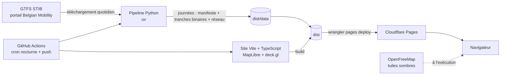

# stib-viz : architecture de la version 1

Statut : figée le 5 septembre 2026, révisée le même jour après une relecture d'architecture
(dix constats intégrés, voir section 11). Périmètre dans [SCOPE.md](SCOPE.md), contexte dans
[docs/01-exploration.md](docs/01-exploration.md). Les versions des bibliothèques sont choisies
au moment de l'implémentation, documentation officielle à l'appui.

## 1. Principes

1. **Statique d'abord.** Tout le travail lourd se fait dans le pipeline. Le navigateur télécharge
   des tableaux binaires et les dessine ; il ne calcule ni horaires ni géométries.
2. **Un contrat de données indépendant de la source.** Le site consomme une « journée » décrite par
   un manifeste et des tranches binaires. L'horaire théorique remplit ce contrat aujourd'hui ; un
   enregistreur temps réel le remplira demain sans toucher au site. Le contrat est testé des deux
   côtés : le pipeline l'écrit, le site le décode, sur le même extrait versionné.
3. **Reproductible et vérifié.** Le pipeline est une fonction pure du GTFS et d'une date. Chaque
   exécution passe des contrôles chiffrés avant publication.
4. **Tests d'abord.** Chaque module naît d'un test qui échoue. La logique est séparée du rendu pour
   rester testable sans navigateur.
5. **Petit et lisible.** Pas de framework d'interface, pas de serveur, pas de base de données.

## 2. Vue d'ensemble



Deux exécutables, un contrat entre eux :

- `pipeline/` produit `dist/data/` : un index des journées, puis par journée un manifeste, des
  tranches binaires par heure et par mode, des fichiers d'arrêts par heure, et par version de flux
  une couche réseau et une table de correspondance pour la v2.
- `web/` est un site statique qui lit `dist/data/` et anime.

## 3. Organisation du dépôt

```
stib-viz/
├── SCOPE.md  ARCHITECTURE.md  README.md  LICENSE
├── docs/                         exploration, décisions, captures
├── pipeline/                     Python 3.12, uv, ruff, pytest
│   ├── pyproject.toml
│   ├── src/stibviz/
│   │   ├── cli.py                stibviz fetch | build | check | index
│   │   ├── fetch.py              téléchargement GTFS avec ETag et empreinte
│   │   ├── gtfs.py               lecture et validation des tables
│   │   ├── service_day.py        date → services actifs → courses de la journée 04:00-04:00
│   │   ├── shapes.py             tracés : distance cumulée, projection des arrêts, simplification
│   │   ├── vehicles.py           enchaînement des courses par block_id, battements, coupures
│   │   ├── trajectories.py       échantillonnage (lon, lat, t) le long des tracés
│   │   ├── slicing.py            découpage par tranche horaire avec recouvrement asymétrique
│   │   ├── network.py            couche réseau, dictionnaire des arrêts, table pour la v2
│   │   ├── stats.py              compteurs par minute, kilomètres, lignes
│   │   ├── encode.py             écriture des binaires, des fichiers d'arrêts et du manifeste
│   │   └── checks.py             contrôles de qualité, seuils, anomalies par objet
│   └── tests/
│       ├── fixtures/gtfs-extrait/   extrait réel de trois lignes (un métro, un tram dont le
│       │                            tracé repasse près de lui-même, un Noctis), moins de 500 Ko,
│       │                            avec ses valeurs attendues versionnées
│       └── …                        fixtures synthétiques minimales et tests unitaires
├── web/                          Vite, TypeScript strict, pnpm
│   ├── index.html
│   ├── src/
│   │   ├── main.ts               assemblage
│   │   ├── data/                 index, manifeste, décodage des tranches, cache et préchargement
│   │   ├── time/                 horloge de journée de service, lecteur (vitesse, pause)
│   │   ├── render/               carte MapLibre, couches deck.gl, positions courantes, sélection
│   │   ├── ui/                   horloge, sélecteur de jour, compteurs, courbe et défilement,
│   │   │                         filtres, panneau véhicule, à propos
│   │   ├── state/                état unique et synchronisation avec l'URL
│   │   ├── theme/                style de fond nocturne, couleurs des modes
│   │   └── i18n/                 fr.ts, textes centralisés
│   ├── tests/                    vitest, dont le test de contrat sur la journée de fixture
│   └── e2e/                      Playwright, test de fumée sur la journée de fixture
├── .github/workflows/
│   ├── ci.yml                    lint, types, tests unitaires, contrat, fumée, à chaque push et PR
│   └── nightly.yml               pipeline sept jours + build + déploiement Cloudflare Pages
└── dist/                         généré, ignoré par git
```

La journée de fixture du site n'est pas un fichier versionné : la CI la produit à chaque
exécution avec `stibviz build` sur l'extrait `pipeline/tests/fixtures/gtfs-extrait/`. Elle ne
peut donc pas dériver du code du pipeline.

## 4. Le pipeline

### 4.1 Entrées

- URL du GTFS statique STIB sur le portail Belgian Mobility (téléchargeable sans clé, environ
  14,5 Mo, mis à jour chaque matin). Un fichier local peut la remplacer pour les tests et le
  travail hors ligne.
- Paramètres, tous avec une valeur par défaut versionnée : tolérance de simplification (2 m),
  début de la journée de service (04:00), recouvrement des tranches (300 s avant la borne basse,
  120 s après la borne haute), seuil de coupure des déplacements à vide (100 m), tolérance
  d'anomalies par objet (0,1 % des courses), fenêtre de journées (hier, aujourd'hui, plus cinq).

### 4.2 Étapes

| Étape | Module | Entrée → sortie | Points d'attention |
|---|---|---|---|
| 1. Télécharger | `fetch` | URL → `gtfs.zip`, ETag, SHA-256 | Requête conditionnelle `If-None-Match` ; le zip est vérifié (taille, entrées attendues, pas de chemin sortant du dossier) |
| 2. Lire et valider | `gtfs` | zip → tables typées | Fichiers et colonnes obligatoires, plage de validité couvrant les dates demandées, heures `HH:MM:SS` avec `HH` pouvant dépasser 24 |
| 3. Journée de service | `service_day` | date → identifiants de services → courses | `calendar` plus exceptions `calendar_dates`. Règle : une course appartient à la journée si son premier départ est dans `[04:00, 28:00)` en temps GTFS de la date. Sa trajectoire est écrite jusqu'à son arrivée ; la partie au-delà de 28:00 est tronquée par interpolation et comptée comme anomalie. Une course dont le départ précède 04:00 est écartée et comptée. La veille n'est jamais chargée : les Noctis du vendredi appartiennent, par cette règle, au ruban du vendredi |
| 4. Tracés | `shapes` | `shapes.txt` → polylignes en mètres, distance cumulée | Projection locale en mètres (Lambert belge 72 ou équirectangulaire centrée sur Bruxelles). La distance cumulée est calculée sur la géométrie d'origine et contrôlée contre `shape_dist_traveled` de `shapes.txt` |
| 5. Projection des arrêts | `shapes` | (tracé d'origine, séquence d'arrêts) → abscisse curviligne de chaque arrêt | Le GTFS STIB n'a pas `shape_dist_traveled` dans `stop_times`. Projection sur le tracé **d'origine**, contrainte à être croissante le long du tracé ; écart arrêt-tracé mesuré et contrôlé |
| 6. Simplification | `shapes` | tracé d'origine → sous-ensemble de sommets | Douglas-Peucker ne retient que des sommets d'origine, qui gardent leur abscisse d'origine. Entre deux sommets retenus, la position s'interpole le long de la corde en proportion des abscisses d'origine. Les kilomètres et les temps sont toujours calculés sur les abscisses d'origine, jamais sur la longueur des cordes |
| 7. Véhicules | `vehicles` | courses → suites de courses par `block_id` | Le battement au terminus n'est pas émis comme segment : le chemin s'arrête à l'arrivée et le suivant reprend au départ ; la tête immobile est affichée par la couche de points (section 6.3). Si la course suivante démarre à plus de 100 m de l'arrivée, il s'agit d'un déplacement à vide : rien n'est dessiné entre les deux. Une course sans `block_id` forme un véhicule à elle seule ; un `block_id` dont deux courses se chevauchent dans le temps est scindé en deux véhicules et compté comme anomalie |
| 8. Trajectoires | `trajectories` | course → liste de `(lon, lat, t)` | Vitesse constante entre deux arrêts consécutifs ; sommets échantillonnés aux sommets retenus du tracé plus les arrêts ; temps en secondes depuis 04:00 |
| 9. Tranches | `slicing` | trajectoires → au plus 24 tranches par mode | La tranche `h` contient les portions actives dans `[h − 300 s, h + 1 h + 120 s)`, coupées par interpolation aux bornes. Le recouvrement amont est dimensionné par la longueur de traînée, l'aval par la latence de bascule. Seules les tranches non vides sont écrites ; la liste du manifeste fait foi |
| 10. Réseau et table v2 | `network` | tracés d'origine simplifiés + courses → segments arrêt à arrêt avec nombre de passages ; dictionnaire des arrêts ; table de correspondance | Cinq classes d'intensité ; le métro porte un attribut « souterrain ». La table de correspondance (section 5.7) n'est pas lue par le site v1 |
| 11. Statistiques | `stats` | courses, véhicules → compteurs | Par mode et par minute (1 440 valeurs) : véhicules actifs, courses parties depuis 04:00 en cumul, kilomètres parcourus depuis 04:00 en cumul ; liste des lignes avec couleurs |
| 12. Encodage | `encode` | tout → fichiers de `dist/data/<date>/` | Voir section 5 |
| 13. Contrôles | `checks` | fichiers produits → rapport | Voir section 4.3 |

### 4.3 Contrôles de qualité

Deux niveaux, avec seuils versionnés :

- **Anomalies globales, bloquantes** : la journée n'est pas publiée.
- **Anomalies par objet, tolérées** sous 0,1 % des courses de la journée : l'objet est écarté ou
  corrigé, l'anomalie est journalisée et résumée dans le manifeste (`anomalies`). Au-delà du seuil,
  la journée est bloquée.

Contrôles bloquants :

1. Fichiers et colonnes obligatoires présents ; la plage de validité couvre la date.
2. Toutes les courses de la journée ont un tracé présent dans `shapes.txt`.
3. Nombre de courses et de véhicules égal au décompte direct des courses dont le départ est dans
   le ruban.
4. Pic de véhicules simultanés égal au décompte direct par minute.
5. Poids : au plus 2,5 Mo par tranche, 35 Mo par journée recouvrement compris ; nombre de sommets
   journalier borné.
6. Chaque ligne a une couleur et un libellé.
7. Le manifeste respecte son schéma JSON ; chaque tranche listée existe et aucune tranche non
   listée n'existe.
8. Relecture des binaires écrits : décodage et vérification d'un échantillon de trajectoires.
9. Distance cumulée recalculée cohérente avec `shape_dist_traveled` de `shapes.txt` (écart
   relatif sous 1 % par tracé).

Anomalies par objet :

1. Écart arrêt-tracé au-delà de 80 m (la médiane globale doit rester sous 15 m).
2. Abscisses d'arrêts non croissantes le long du tracé.
3. Temps non croissants le long d'une trajectoire.
4. Course dont le départ précède 04:00 ou dont l'arrivée dépasse 28:00 (tronquée).
5. Chevauchement temporel à l'intérieur d'un `block_id`.
6. Déplacement à vide détecté (information seulement, jamais comptée comme anomalie).

Les valeurs mesurées pour le mercredi 9 septembre 2026 (18 784 courses, 1 299 véhicules, pic de
776 véhicules à 17:03) sont un **critère d'acceptation manuel du jalon M1**, pas un test de CI :
elles expirent avec le flux le 27 septembre 2026. La CI s'appuie sur l'extrait versionné et ses
propres valeurs attendues.

### 4.4 Interface en ligne de commande

```
stibviz fetch  --url <URL> --out cache/          télécharge si le flux a changé
stibviz build  --gtfs cache/gtfs.zip --date 2026-09-09 --out dist/data/
stibviz check  --day dist/data/2026-09-09/
stibviz index  --data dist/data/                 écrit dist/data/index.json
```

Chaque commande renvoie un code de sortie non nul en cas d'échec et écrit un journal lisible.

### 4.5 Performance visée

Moins de 60 s par journée, moins de 8 minutes pour les sept journées sur un exécuteur GitHub
standard. L'analyse de faisabilité a lu et agrégé le GTFS complet en une trentaine de secondes
avec pandas ; la génération des trajectoires est vectorisée avec numpy.

## 5. Contrat de données

Tout ce que le site connaît des données passe par ces fichiers. Le pipeline est le seul à les
écrire ; un enregistreur temps réel les écrira au même format en v2.

### 5.1 Arborescence

```
dist/data/
├── index.json                       journées disponibles, version du flux, date de génération
├── network/<version-du-flux>.json   couche réseau et dictionnaire des arrêts, partagés
├── lookup/<version-du-flux>.json    table de correspondance pour la v2, non lue par le site v1
└── 2026-09-09/
    ├── manifest.json                statistiques, lignes, véhicules, index des tranches
    ├── slices/
    │   ├── 04-metro.bin  04-tram.bin  04-bus.bin
    │   ├── 05-metro.bin  ...
    │   └── 27-bus.bin               l'heure 27 correspond à 03:00 le lendemain
    └── stops/
        ├── 04.json  05.json  ...    arrêts des courses actives dans l'heure, chargés au clic
```

Seules les tranches non vides existent : un mercredi n'a aucun fichier Noctis, un samedi en a pour
les heures 00 à 03 du lendemain. Le site ne demande que ce que le manifeste liste.

### 5.2 `index.json`

```json
{
  "generated_at": "2026-09-09T06:40:12Z",
  "feed_version": "2_20_20260831_010702",
  "feed_valid_from": "2026-08-31",
  "feed_valid_to": "2026-09-27",
  "service_day_start": "04:00",
  "days": [
    { "date": "2026-09-08", "kind": "weekday", "source": "schedule", "manifest": "2026-09-08/manifest.json" },
    { "date": "2026-09-09", "kind": "weekday", "source": "schedule", "manifest": "2026-09-09/manifest.json" }
  ]
}
```

`source` vaut `schedule` en v1 ; une journée enregistrée en v2 vaudra `recorded`, ce qui permet au
site de proposer le choix sans ouvrir les manifestes.

### 5.3 `manifest.json`

Budget : 300 Ko au plus. Il ne contient ni géométrie ni arrêts.

```json
{
  "date": "2026-09-09",
  "source": "schedule",
  "feed_version": "2_20_20260831_010702",
  "attribution": "Source: STIB-MIVB – Open Data – 2026-09-05",
  "network": "network/2_20_20260831_010702.json",
  "totals": { "trips": 18784, "vehicles": 1299, "km": 164365 },
  "per_minute": {
    "vehicles":   { "metro": [0, 0, "…"], "tram": ["…"], "bus": ["…"], "noctis": ["…"] },
    "departures": { "metro": [0, 0, "…"], "tram": ["…"], "bus": ["…"], "noctis": ["…"] },
    "km":         { "metro": [0, 0, "…"], "tram": ["…"], "bus": ["…"], "noctis": ["…"] }
  },
  "lines": [
    { "id": "1", "name": "1", "mode": "metro", "color": "B5378C", "text_color": "FFFFFF",
      "long_name": "GARE DE L'OUEST - STOCKEL" }
  ],
  "vehicles": [
    { "block": "10474606", "trips": [
      { "line_idx": 12, "headsign": "BRUSSELS CITY", "start": 4080, "end": 6060 }
    ] }
  ],
  "slices": [
    { "hour": 4, "mode": "metro", "path": "slices/04-metro.bin", "bytes": 81240, "vertices": 6770, "paths": 41 }
  ],
  "stops_files": [ { "hour": 4, "path": "stops/04.json", "bytes": 210400 } ],
  "anomalies": { "stop_offset": 3, "truncated_after_28h": 0, "block_overlap": 0 }
}
```

Chaque série `per_minute` compte 1 440 valeurs, de 04:00 à 03:59 le lendemain ; `vehicles` est
un instantané, `departures` et `km` sont des cumuls depuis 04:00. Les compteurs et la courbe
d'activité de l'interface se lisent directement dans ces séries. Les temps de `vehicles[].trips`
sont en secondes depuis 04:00 ; ils suffisent à placer la tête d'un véhicule en battement.

### 5.4 Tranche binaire `HH-mode.bin`

Petit-boutien, un seul fichier par heure et par mode, écrit seulement s'il contient un chemin :

| Champ | Type | Contenu |
|---|---|---|
| en-tête | 6 × Uint32 | magie `0x53545631` (« STV1 »), version, nombre de sommets `V`, nombre de chemins `P`, heure de la tranche, réservé |
| positions | Float32 × 2V | longitude, latitude entrelacées |
| temps | Float32 × V | secondes depuis 04:00 de la journée de service |
| index | Uint32 × (P + 1) | position de départ de chaque chemin dans les tableaux, dernier élément égal à `V` |
| véhicule | Uint32 × P | index dans `manifest.vehicles` |
| course | Uint16 × P | index de la course dans le véhicule |
| ligne | Uint16 × P | index dans `manifest.lines`, source de la couleur |

Un chemin est une portion continue de trajectoire d'un véhicule dans la tranche ; il ne contient
jamais deux sommets consécutifs identiques. Un véhicule peut donner plusieurs chemins (coupure au
terminus, déplacement à vide, bornes de tranche). Positions, temps et index se passent tels quels
à deck.gl ; la couleur par sommet est dépliée une fois au chargement à partir de `ligne`.

Précision : en Float32, la longitude est quantifiée à 3 cm et la latitude à 40 cm à Bruxelles, ce
qui est invisible à l'échelle de la ville. Les secondes depuis 04:00 restent des entiers exacts.
Si le poids devient un problème, la v2 quantifie les positions sur 16 bits relatifs à la boîte
englobante (voir SCOPE.md section 6).

### 5.5 Couche réseau `network/<version>.json`

GeoJSON de segments arrêt à arrêt, simplifiés, avec `mode`, `runs` (passages par jour de semaine
type), `class` (1 à 5) et `underground` (vrai pour le métro), plus un dictionnaire `stops` qui
donne pour chaque `stop_id` sa position et son nom en français. Un seul fichier par version de
flux, environ 1 Mo, en cache long.

### 5.6 Arrêts d'une heure `stops/HH.json`

Pour chaque course active dans l'heure, la liste de ses arrêts avec l'heure théorique de passage,
clé `"<index véhicule>:<index course>"` :

```json
{ "412:3": [[46800, "1781"], [46920, "4351"], [47040, "4359"]] }
```

Chargé au premier clic dans l'heure, jamais avant. Les noms viennent du dictionnaire `stops` de la
couche réseau.

### 5.7 Table de correspondance `lookup/<version>.json`

Écrite par la v1, lue seulement par le convertisseur temps réel de la v2 : pour chaque tracé, la
liste ordonnée de ses arrêts avec leur abscisse curviligne ; pour chaque ligne et direction, les
tracés candidats. C'est le seul artefact dont l'enregistreur aura besoin en plus des modules du
pipeline.

## 6. Le site

### 6.1 Flux de données au chargement

1. Lire `index.json` ; choisir la journée (URL, sinon aujourd'hui, sinon la plus proche).
2. Lire le manifeste et la couche réseau ; construire la courbe d'activité et les compteurs.
3. Charger les tranches de l'heure courante pour les modes visibles, parmi celles que le
   manifeste liste ; démarrer la lecture.
4. Pendant la lecture, précharger l'heure suivante ; garder trois heures en cache mémoire.
5. **Une seule tranche par mode est montée à un instant donné.** Le recouvrement sert au
   préchargement et à la bascule, jamais à un double affichage. Si la tranche suivante n'est pas
   prête au moment de la bascule, la lecture attend visiblement au lieu d'afficher une heure
   incomplète.
6. Au changement de journée, tout recommencer depuis l'étape 2.

Budget de première image : manifeste au plus 300 Ko, couche réseau au plus 1 Mo (cache long),
une heure de tranches au plus 2,5 Mo ; au plus 4 Mo au total, hors tuiles de fond.

### 6.2 Modules et responsabilités

| Module | Rôle | Testé par |
|---|---|---|
| `data/` | Chargement et décodage des fichiers du contrat, cache et préchargement, arrêts à la demande | vitest : décodage de la journée de fixture produite par le pipeline (test de contrat), cache, ordre de préchargement, tranches absentes jamais demandées |
| `time/` | Horloge de journée de service (secondes depuis 04:00), lecteur à vitesse variable basé sur `requestAnimationFrame`, conversion en heure civile, attente de tranche | vitest : 90 000 s affiche 05:00 le lendemain, vitesses, pause, bornes, attente |
| `render/` | Carte MapLibre, style nocturne, couche réseau, couches deck.gl, positions courantes des véhicules, sélection au clic | vitest pour le calcul de position, le battement et l'unicité des véhicules montés ; fumée Playwright pour le rendu |
| `state/` | Objet d'état unique, abonnements, lecture et écriture de l'URL | vitest : aller-retour URL, valeurs invalides ignorées |
| `ui/` | Composants DOM sans framework : horloge, sélecteur, compteurs, courbe et défilement, filtres, panneau véhicule, à propos | vitest avec DOM simulé pour la logique ; fumée pour l'assemblage |
| `theme/` | Couleurs des modes, style de fond, constantes visuelles | revue visuelle |
| `i18n/` | Textes français | test qui vérifie l'absence de clé manquante |

### 6.3 Rendu

- Quatre `TripsLayer` deck.gl, une par mode, alimentées en attributs binaires : positions, temps et
  index de départ passés tels quels ; couleur par sommet dépliée une fois au chargement de la
  tranche à partir du champ `ligne`. Les propriétés exactes du passage binaire (`startIndices`,
  attributs, type de chemin ouvert) sont fixées sur la documentation officielle au jalon M2, avec
  un test qui vérifie que deck.gl ne recopie ni ne renormalise les chemins. Seule `currentTime`
  change à chaque image. Longueur de traînée constante en secondes de journée (valeur initiale
  150 s, toujours inférieure au recouvrement amont de 300 s), fondu activé : la longueur visible
  encode la vitesse.
- Une `ScatterplotLayer` pour les têtes de véhicules : à chaque image, la position courante de
  chaque chemin actif est obtenue par recherche dichotomique dans son tableau de temps puis
  interpolation. Un véhicule en battement entre deux courses (`end` de l'une, `start` de la
  suivante dans le manifeste, même terminus) garde la position de fin de sa dernière course :
  son point reste, sa traînée s'éteint. Moins de 800 points au pic, coût négligeable. Cette
  couche porte la sélection au clic ; le panneau charge alors `stops/HH.json` si nécessaire.
- Un véhicule n'est jamais dessiné deux fois : une seule tranche montée par mode (section 6.1) ;
  un test vitest le vérifie sur la journée de fixture.
- La couche réseau est une `GeoJsonLayer` sombre, sous les véhicules ; le métro y est plus estompé.
- Filtrer un mode masque sa couche et retire ses tranches du préchargement.
- Options de performance : `useDevicePixels` désactivable sur écrans très denses ; couches créées
  une fois ; aucune allocation par image en dehors de la bascule de tranche.

### 6.4 État et URL

Un seul objet d'état (journée, instant, vitesse, lecture, filtres, vue caméra, véhicule
sélectionné). Chaque changement notifie les composants. L'URL se met à jour avec un léger délai :

```
/?d=2026-09-09&t=17:03&s=300&m=metro,tram,bus,noctis&c=50.846,4.352,12.4,0,0&p=1
```

Le lien recrée exactement la scène. Les valeurs invalides sont ignorées une à une.

### 6.5 Style nocturne

- Fond : style OpenFreeMap sombre, réduit à la voirie, l'eau, les parcs et quelques toponymes,
  tous très sombres. Le fond ne doit jamais concurrencer les véhicules.
- Modes : métro blanc chaud, tram dans sa couleur officielle, bus bleu froid unique, Noctis violet.
  Les valeurs exactes vivent dans `theme/` et sont réglées au jalon M2 sur le rendu réel.
- Réseau : cinq niveaux d'un même gris bleuté, du presque invisible au discret.
- Interface : panneaux translucides sombres, typographie sobre, chiffres à largeur fixe.

### 6.6 Accessibilité et clavier

Espace : lecture et pause. Flèches : une minute ; avec Majuscule : dix minutes. Touches 1 à 4 :
vitesses ×60, ×120, ×300, ×600. Tous les boutons ont un libellé et un état de focus visible. Si
l'utilisateur préfère moins de mouvement, la page démarre en pause.

## 7. Intégration et déploiement

### 7.1 `ci.yml` (à chaque push et pull request)

1. Pipeline : `uv sync`, `ruff check`, `pytest --cov` avec seuil 80 %, dont les tests sur
   l'extrait `gtfs-extrait/` et ses valeurs attendues.
2. Journée de fixture : `stibviz build` puis `stibviz check` sur l'extrait, sortie dans un dossier
   temporaire consommé par les étapes suivantes.
3. Site : `pnpm install`, `tsc --noEmit`, `eslint`, `vitest --coverage` avec seuil 80 %, dont le
   test de contrat qui décode la journée de fixture.
4. Fumée : `pnpm build` avec la journée de fixture, puis Playwright : la page se charge, le canevas
   existe, l'horloge avance en lecture, l'URL se met à jour, le panneau véhicule s'ouvre depuis un
   état injecté.

### 7.2 `nightly.yml` (cron après la publication du GTFS, et déclenchement manuel)

1. `stibviz fetch` avec cache d'ETag ; si le flux est inchangé et que toutes les journées de la
   fenêtre sont déjà publiées, arrêt anticipé.
2. `stibviz build` puis `stibviz check` pour chacune des sept journées, indépendamment : une
   journée en échec est mise de côté sans interrompre les autres.
3. `stibviz index` sur les seules journées valides.
4. `pnpm build`, copie de `dist/data/` dans le site construit.
5. `wrangler pages deploy` vers le projet Cloudflare Pages, branche de production `main`.
6. Seulement ensuite, code de sortie non nul si au moins une journée a échoué, pour être averti
   sans priver le site des journées valides. Journaux conservés quatorze jours.

Secrets GitHub : `CLOUDFLARE_API_TOKEN`, `CLOUDFLARE_ACCOUNT_ID`. Variable : nom du projet Pages.

### 7.3 Cloudflare Pages

- Limites connues : 20 000 fichiers et 25 Mo par fichier par déploiement. Sept journées font
  moins de 900 fichiers de moins de 3 Mo : large marge.
- En-têtes : `index.json` sans cache ; manifestes, tranches et arrêts en cache court (une heure) ;
  couche réseau et table de correspondance nommées par version de flux, cache long.
- Compression : à mesurer au jalon M1 sur une tranche réelle plutôt qu'à supposer. Si le gain
  dépasse 15 %, servir les tranches sous un type de contenu que la plateforme compresse ; sinon
  le poids reste maîtrisé à la source par la simplification.

## 8. Extension vers le temps réel (v2)

Rien de ce qui suit n'est construit en v1 ; tout est prévu pour ne rien casser.

- **Contrat inchangé.** Une journée réelle est un dossier `2026-09-09-live/` avec `source:
  "recorded"` dans `index.json` et dans son manifeste. Le site affiche un choix « théorique /
  réel » quand les deux existent pour une date.
- **À vérifier en priorité : un GTFS-RT existe peut-être pour la STIB.** Le catalogue du
  portail Belgian Mobility annonce, pour STIB-MIVB, un flux GTFS-RT avec deux composantes
  (mises à jour de trajets, alertes de service), toutes les 30 s ; la base de connaissances du
  même portail affirme l'inverse (« STIB-MIVB does not produce GTFS-RT feeds ») et ne publie
  d'URL que pour De Lijn, TEC et SNCB. Sondé sans compte le 5 septembre 2026, l'hôte du flux
  temps réel ne résout même pas en DNS : la question reste ouverte. À trancher dès la création
  du compte développeur, avant d'écrire le convertisseur : un GTFS-RT donnerait directement des
  retards par arrêt et par course, avec l'identité de la course, sans avoir à reconstruire
  l'identité des véhicules comme l'exige VehiclePositions ci-dessous. S'il existe, il remplace
  l'enregistreur décrit plus bas ; sinon, la voie VehiclePositions reste la solution de repli.
- **Enregistreur séparé.** Un service minimal interroge l'API VehiclePositions toutes les quinze à
  vingt secondes avec une clé « standard » (12 000 requêtes par jour autorisées, 5 760 utilisées)
  et archive les réponses brutes horodatées. Candidats : Worker Cloudflare planifié à la minute
  qui effectue quatre appels espacés, ou machine domestique. Aucun appel ne part jamais d'un
  navigateur.
- **Conversion réutilisant le pipeline.** La table `lookup/<version>.json` donne, pour une ligne
  et une direction, les tracés candidats et la position des arrêts le long de chacun : une
  position « dernier arrêt + distance » devient une abscisse curviligne puis un point sans rejouer
  la lecture du GTFS. Un nouveau module apparie les véhicules d'un instantané au suivant et produit
  des trajectoires ; `slicing`, `encode` et `checks` ne changent pas.
- **Identifiants : correspondance à établir, pas acquise.** Les `stop_id` du GTFS et les `pointId`
  de l'API partagent le même schéma (`0470F`, `4074B`), mais l'appariement exact, les suffixes de
  quai et les variantes doivent être vérifiés sur des données enregistrées. Les `lineid` de l'API
  correspondent aux `route_short_name` pour les lignes vues le 5 septembre 2026 ; un éventuel
  préfixe des trams (« T81 ») et l'absence signalée des Noctis côté API sont des cas connus à
  traiter : une journée enregistrée pourra être privée d'un mode et devra le dire.

## 9. Journal des décisions

| Décision | Alternatives écartées | Raison |
|---|---|---|
| Trajectoires précalculées | Calcul dans le navigateur à partir des horaires | Moins de code côté site, format identique pour une source enregistrée |
| Tolérance 2 m | 5 m, 10 m | Volume comparable à la référence tout en gardant les courbes de rue nettes |
| Projection des arrêts sur le tracé d'origine, avant simplification | Projection après simplification | Une épingle rabotée par la simplification peut inverser deux arrêts |
| Recouvrement asymétrique 300 s / 120 s | 600 s de chaque côté | Le recouvrement amont sert la traînée, l'aval la bascule ; +12 % de volume au lieu de +33 % |
| Un fichier par heure et par mode, tranches vides non écrites | Trois fichiers comme la référence ; un seul fichier par jour | Chargement paresseux par heure et par filtre, aucune requête inutile |
| Arrêts hors du manifeste, dans des fichiers par heure | Arrêts dans le manifeste | Le manifeste passerait de 300 Ko à plusieurs Mo pour une information consultée au clic |
| Battement non dessiné comme segment | Segment de longueur nulle | Cas dégénéré pour le rendu de chemins ; la couche de points suffit |
| Anomalies par objet tolérées sous 0,1 % | Tout-ou-rien | Une course aberrante ne doit pas priver le site d'une journée |
| Float32 lon/lat | Coordonnées entières relatives | Simplicité en v1 ; quantification documentée en v2 |
| Ruban 04:00 → 04:00 par le premier départ | Minuit à minuit avec veille | Aucune couture, Noctis inclus naturellement, règle testable |
| Véhicules par `block_id` | Courses indépendantes | Battements visibles, compteurs exacts, base du suivi en v2 |
| Coupure des déplacements à vide | Ligne droite entre terminus | Pas de trait fictif à travers la ville |
| Vitesse maximale ×600 | ×1800 comme la référence | À ×1800 une image avance de 30 s de service, effet stroboscopique et préchargement intenable |
| TripsLayer + ScatterplotLayer | Couche WebGL maison | Éprouvé, traînées gratuites, sélection au clic simple |
| Sans framework d'interface | React, Svelte | Une dizaine de composants simples ; bundle minimal |
| pandas + numpy + shapely + pyproj | polars, GeoPandas | Déjà validé sur le GTFS complet en une trentaine de secondes |
| GitHub Actions + wrangler | Build intégré Cloudflare Pages | Planification nocturne native, même schéma que la référence |
| Journée de fixture produite en CI | Fixture versionnée | Impossible de dériver du code du pipeline |

## 10. Points techniques ouverts

À trancher pendant l'implémentation, avec un test à l'appui :

- Choix entre projection Lambert 72 et équirectangulaire locale pour les distances et la
  simplification : les deux sont exactes au centimètre à l'échelle de Bruxelles ; retenir la plus
  simple à tester.
- Propriétés exactes du passage d'attributs binaires à `TripsLayer` : à fixer sur la documentation
  officielle de la version retenue, avec le test de non-recopie décrit en 6.3.
- Temps d'arrêt fictif aux stations : le GTFS STIB donne presque toujours des temps d'arrêt nuls.
  La v1 les respecte ; un paramètre `dwell_seconds` reste disponible si le rendu semble trop lisse.
- Compression des tranches : mesure au jalon M1, décision selon le gain (section 7.3).
- Changement d'heure : les journées de fin mars et de fin octobre gardent 24 heures GTFS ; l'écart
  d'une heure civile est affiché tel quel et documenté dans le panneau à propos.
- Correspondance des identifiants avec l'API temps réel : à établir en v2 sur des données
  enregistrées (section 8).

## 11. Historique

- 5 septembre 2026, v1.0 : rédaction après les dix questions de cadrage.
- 5 septembre 2026, v1.1 : relecture d'architecture, dix constats intégrés : taille du manifeste
  et compteurs cumulés ; règle du ruban par premier départ et troncature à 28:00 ; recouvrement
  asymétrique et budget journalier ; extrait GTFS versionné, journée de fixture produite en CI,
  chiffres du 9 septembre reclassés en acceptation manuelle ; champ `ligne` par chemin, battement
  sans segment, propriétés binaires à fixer ; projection avant simplification et calcul des
  distances sur le tracé d'origine ; une seule tranche montée par mode et tranches vides non
  écrites ; anomalies par objet et ordre du déploiement nocturne ; vitesse plafonnée à ×600 ;
  `source` dans l'index, table de correspondance pour la v2, prudence sur les identifiants.
